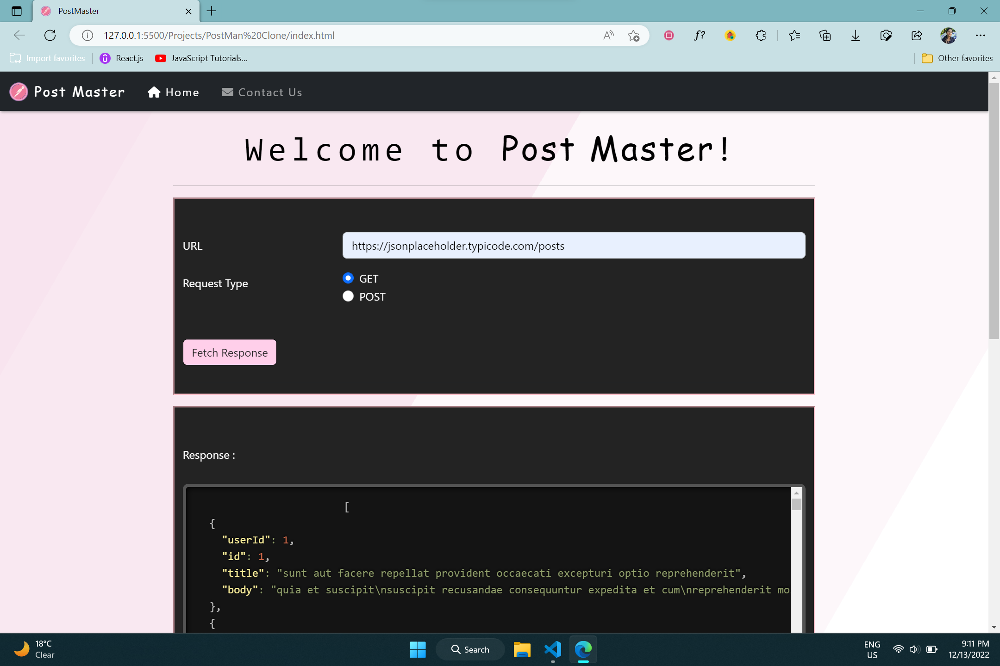

# 📮 PostMaster
Post Master is a website that fetches responses from RESTful APIs using GET and POST methods.

## Get Started with PostMaster
🔹Specify the **REST API URL** and select from **GET** and **POST** request types.  
   To get your URL and get started, you can visit the following APIs:  
  🔸OpenWeather API  
  🔸News API  
  🔸Random User API  
  🔸JSON Placeholder - Fake REST API  

🔹If you have chosen a **POST Request**, you have the option to specify your **Content type** as either **JSON** or provide **Custom Parameters**.  

🔹If you select the **JSON Content type**, enter your JSON Request and click on "Fetch Response" to obtain the desired response.  

🔹When choosing the **Custom Parameters Content type**, you have the freedom to add or remove any number of key-value pairs.  

   
 (PostMaster uses **Prism.js** Library integrating plugins like Copy-to-Clipboard for enhanced functionality.)

## Live Application URL

Go to Deployed Application link 👇  
<a href="https://Kakuli-coder.github.io/PostMaster" alt="PostMaster-App-link">PostMaster</a>  

## PostMaster Preview

  
